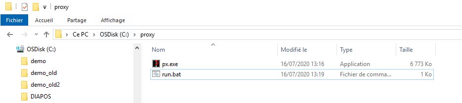
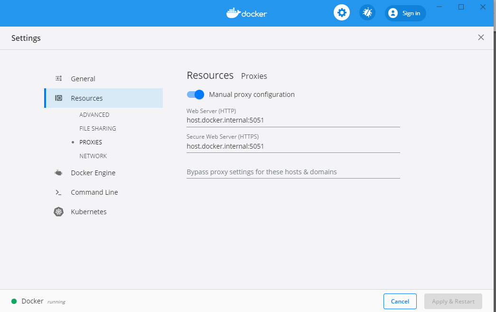
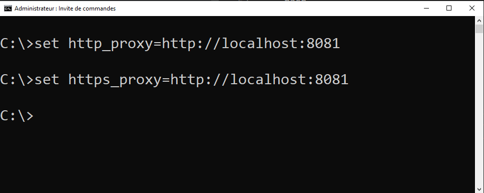

# Devenez un pro du développement derrière un proxy sous Windows

Beaucoup de logiciel n’envoie pas les credentials de votre session Windows dans les requêtes réseaux (surtout pour sortir sur internet). Résultat les proxies ne vous connaissent pas et rejettent vos requêtes.
Solution : installer un reverse proxy sur votre poste qui va automatiquement ajouter les credentials dans les requêtes. Il vous faut alors configurer les logiciels pour que les requêtes http passe par se reverse proxy local.

## Installer px (Windows only)
Télécharger px : 
https://github.com/genotrance/px/releases/tag/vHEAD
Mettez ensuite l'exécutable dans le dossier « C:\proxy »
Créer un fichier « C:\proxy\run.bat » avec le contenu ci-dessous :

```bash
px.exe --server=http://myinternalproxy.fr --listen=127.0.0.1 --port=5051 --gateway=0 --hostonly=0 --allow=*.*.*.* --noproxy=127.0.0.* --idle=5 --socktimeout=2.0 --foreground=0 --log=0
```

Vous devriez avoir quelque chose comme cela :


Lorsque vous exécuter ce fichier .bat votre proxy sera lancé et disponible via l’adresse :
http://localhost:5051

## Docker

Pour docker configurer le proxy en utiliser l’adresse : 
- host.docker.internal :5051



Cela va permettre aux instances dockers d’utiliser votre proxy local.
 

Pour builder une image, il vous faut préciser le proxy :
```bash
docker build . -t demo --build-arg https_proxy=http://host.docker.internal:5051 --build-arg http_proxy=http://host.docker.internal:5051
```

Idem si vous utilisez docker-compose :
```bash
docker-compose build --build-arg https_proxy=http://host.docker.internal:5051 --build-arg http_proxy=http://host.docker.internal:5051
```

## GIT et github

Pour accéder à github ajouter cette configuration dans votre fichier .gitconfig.
C:\Users\YOUUSERNAME\\.gitconfig

```bash
[http "https://github.com"]
       sslverify = false
       proxy = http://localhost:5051
[https "https://github.com"]
	  proxy = http://localhost:5051
[url "https://"]
        insteadOf = git://
```

## Node et npm

Pour pouvoir réaliser un « npm install », ajouter cette configuration dans votre fichier . npmrc.

« C:\Users\YOUUSERNAME\\.npmrc »

```bash
strict-ssl=false
http-proxy=http://localhost:5051
https-proxy=http://localhost:5051
```

## CMD

Lorsque vous avez des problèmes de proxy via la ligne de commande CMD. Cela va mettre à jour les variables proxy uniquement sur votre session CMD courante.

```bash
set http_proxy=http://localhost:5051
set https_proxy=http://localhost:5051
```




## Python et PIP

```bash
pip install -r requirements.txt --proxy=http://localhost:5051
```